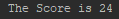
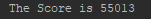
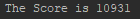
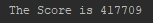
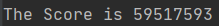

# Bibliocat

Puntuació total: 59.887.358

# Score A

# Score B
 

# Score C

# Score D

# Score E

* En el mateix repositori es troba OUT.zip amb els outputs per a cada input. 
* També hi ha part del codi utilitzat per obtenir-los.